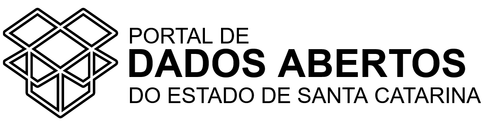

# 👋 Bem-vindos!

## Apresentação

O [Portal de Dados Abertos do Estado de Santa Catarina](http://dados.sc.gov.br/) tem como principal objetivo prover a infraestrutura básica para a efetiva abertura de dados governamentais pelo Poder Executivo Estadual, seguindo princípios de governo aberto:&#x20;

* disseminação de informações de interesse público;
* melhoria da qualidade dos dados e serviços disponibilizados; e
* promoção da transparência e do controle social.

Transparência ativa e dados abertos são princípios que fazem parte do conceito de governo aberto estabelecido pela [Open Government Partnership – OGP](https://www.opengovpartnership.org/), essenciais para a consolidação de um regime democrático e para uma boa gestão pública. Por meio deles, os cidadãos podem acompanhar a implementação de políticas públicas e exercer o controle social.

Um governo transparente é um governo que facilita o acesso às informações de interesse público, de forma proativa e espontânea, numa linguagem clara e de fácil entendimento, inclusive para leitura por máquinas. A transparência governamental também ajuda a melhorar os níveis de credibilidade e legitimidade de um governo.

Com a publicação da [Lei de Responsabilidade Fiscal](https://www.planalto.gov.br/ccivil\_03/leis/lcp/lcp101.htm), em 2000, o Brasil deu os primeiros passos neste sentido, regulamentando no art.48 os instrumentos de transparência da gestão fiscal.

Em 2009, com a publicação da [Lei Complementar nº 131](https://www.planalto.gov.br/ccivil\_03/leis/lcp/lcp131.htm), conhecida como Lei da Transparência, foram estabelecidas as regras para a disponibilização, em tempo real, de informações pormenorizadas sobre a execução orçamentária e financeira da União, dos Estados, do Distrito Federal e dos Municípios.

Em 2011 foi publicada a [Lei nº 12.527](https://www.planalto.gov.br/ccivil\_03/\_ato2011-2014/2011/lei/l12527.htm), regulamentando o acesso à informação. Nos artigos 7º e 8º, são estabelecidas as obrigações das instituições públicas em publicar dados em formato aberto.

Em Santa Catarina, a [Controladoria-Geral do Estado](https://cge.sc.gov.br/) é o órgão responsável pela coordenação da política de transparência e dados abertos.

## Acesse o Portal de Dados Abertos&#x20;

O Portal de Dados Abertos pode ser acessado a partir do endereço [https://dados.sc.gov.br/](https://dados.sc.gov.br/) ou dos sítios oficiais do Governo do Estado de Santa Catarina por meio do ícone indicado a seguir:

<figure><figcaption>
Logotipo do Portal de Dados Abertos
</figcaption></figure>

Mais informações podem ser encontradas no [Portal da Transparência do Poder Executivo do Estado de Santa Catarina](http://www.transparencia.sc.gov.br/), acessado em [https://transparencia.sc.gov.br/](https://transparencia.sc.gov.br/).

Caso não tenha encontrado os dados que procurava entre em contato pelo email gedad@cge.sc.gov.br ou faça um pedido de acesso à informação (LAI) pela [Ouvidoria-Geral do Estado](http://www.ouvidoria.sc.gov.br/cidadao\_lai.php), acessado em [http://ouvidoria.sc.gov.br/](http://ouvidoria.sc.gov.br/), opção 3 - E-SIC.

Se você quiser contribuir ou relatar algo entre em contato com Gerência de Transparência e Dados Abertos, pelo e-mail gedad@cge.sc.gov.br ou pelo telefone (48) 3665-2406.
