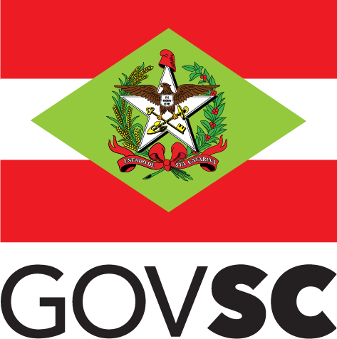

# 📞 Contatos

O Portal de Dados Abertos é mantido pela Controladoria-Geral do Estado, por meio da equipe da Gerência de Transparência e Dados Abertos, da Ouvidoria-Geral do Estado de Santa Catarina. 

📧 gedad@cge.sc.gov.br 

📠(48) 3665-2406 

Site da [CGE/SC](https://cge.sc.gov.br/) 

Instagram da [CGE/SC](https://www.instagram.com/cge.sc/)

<figure><figcaption></figcaption></figure>

<figure><figcaption></figcaption></figure>
