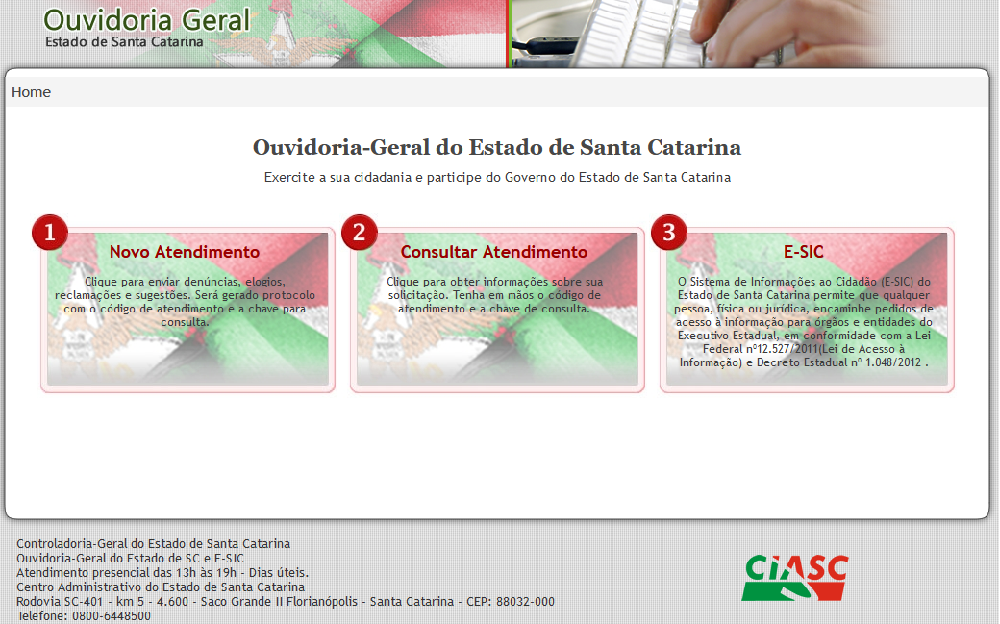

# Manifestações de Ouvidoria

## Introdução

Os pedidos de acesso à informação são cadastrados pelo Sistema de Gestão de Ouvidoria (OUV), acessado em [www.ouvidoria.sc.gov.br](http://ouvidoria.sc.gov.br/), na opção 1 - Novo Atendimento.

<figure><figcaption>
Tela Inicial do Sistema de Ouvidoria
</figcaption></figure>

Nesta opção você pode enviar as denúncias, reclamações, solicitações, elogios ou sugestões.

<figure><figcaption></figcaption></figure>



### Perguntas Frequentes sobre ouvidoria

Quais os tipos de manifestações de ouvidoria?

Os tipos são:

* Denúncias;
* Reclamações;
* Solicitações;
* Elogios; e
* Sugestões.

Qual o prazo para atendimento das demandas?

Após o registro da manifestação, a Ouvidoria-Geral procede à análise preliminar da manifestação. As manifestações são encaminhadas às ouvidorias setoriais ou seccionais diretamente envolvidas, as quais respondem à Ouvidoria-Geral do Estado para envio da Decisão Administrativa Final ao usuário no prazo legalmente estabelecido de até 30 dias.

Posso fazer uma demanda sigilosa?

Sim, todos os dados do denunciante são protegidos.

O que é uma denúncia?

É a comunicação de prática de irregularidade ou ato ilícito cuja solução dependa da atuação dos órgãos apuratórios competentes.

O que é uma reclamação?

É a demonstração de insatisfação relativa ao serviço ou à política pública.

O que uma solicitação?

É o requerimento de adoção de providência por parte da Administração Pública Estadual

O que é um elogio?

É a demonstração de reconhecimento e/ou satisfação a respeito da política pública, do serviço público oferecido ou do atendimento recebido.

O que é uma sugestão?

É a proposição de ideia ou formulação de proposta de aprimoramento de políticas e serviços públicos.

O que são ouvidorias setoriais?

Ouvidorias Setoriais são as ouvidorias dos órgãos da administração direta do Poder Executivo Estadual.

O que são ouvidorias seccionais?

Ouvidorias Seccionais são as ouvidorias das entidades da administração indireta do Poder Executivo Estadual.

O que são unidades de ouvidoria?

Unidades de Ouvidorias são os diversos setores dos órgãos ou das entidades responsáveis pelas informações às Ouvidorias Setoriais e/ou Seccionais para a elaboração da Decisão Administrativa Final ao usuário.

