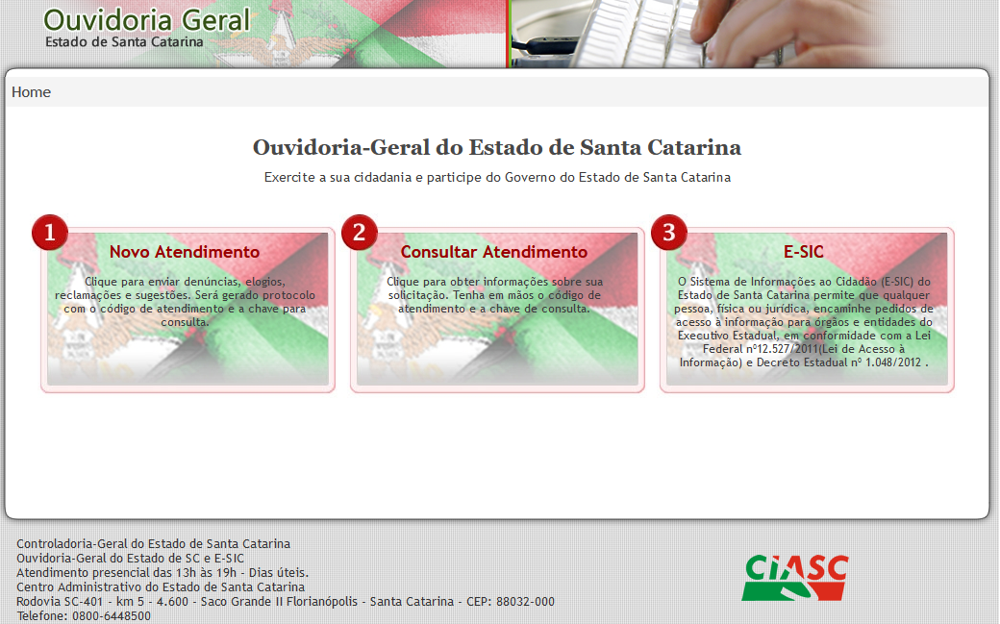

# Pedidos de Acesso à Informação

## Introdução

Os pedidos de acesso à informação são cadastrados pelo Sistema de Gestão de Ouvidoria (OUV), acessado em [www.ouvidoria.sc.gov.br](http://ouvidoria.sc.gov.br/), na opção 3 - E-SIC.

<figure><figcaption><p>Tela Inicial do Sistema de Ouvidoria</p></figcaption></figure>

Nesta opção você pode solicitar os conjuntos de dados e informações preenchendo o campo Reivindicação e demais campos obirgatórios.

<figure><figcaption><p>Tela do Pedido de Acesso à Informação</p></figcaption></figure>

[http://200.19.215.246:3000/public/dashboard/88697893-7583-4f61-9e5a-20858a65c98b](http://200.19.215.246:3000/public/dashboard/88697893-7583-4f61-9e5a-20858a65c98b)

### Perguntas Frequentes sobre LAI

<details>

<summary>O que é a Lei de Acesso à Informação e o Decreto n. 1.048/2012?</summary>

A Lei nº 12.527/2011, conhecida como Lei de Acesso à Informação - LAI, regulamenta o direito, previsto na Constituição, de qualquer pessoa, física ou jurídica, solicitar e receber dos órgãos e entidades públicos, de todos os entes e Poderes, informações públicas por eles produzidas ou custodiadas.

No âmbito do Poder Executivo Estadual, a regulamentação específica da Lei de Acesso à Informação ocorreu com a publicação do Decreto n. 1.048/2012, que estabeleceu os procedimentos para a garantia do acesso à informação e para a classificação de informações sob restrição de acesso.

</details>

<details>

<summary>O que devo fazer para ter acesso à informações públicas?</summary>

O pedido de acesso à informação deve ser cadastrado pelo Serviço Eletrônico de Informações ao Cidadão (e-SIC), opção 3 do Sistema Informatizado de Ouvidoria, disponível no seguinte endereço: http://www.ouvidoria.sc.gov.br/cidadao/

No momento do registro, o sistema gera um número de atendimento e chave de consulta, por meio da qual o requerente pode monitorar o cumprimento do prazo legal, acompanhar as respostas aos pedidos de acesso e solicitar recursos.

Além do Sistema Informatizado de Ouvidoria, o pedido de acesso à informação poderá ser solicitado através dos seguintes canais:

* Portal de Transparência: http://www.transparencia.sc.gov.br/fale-conosco;
* Central de Atendimento Telefônico da Ouvidoria: 0800-644-8500 / (048) 3665-1646;
* Correio, físico ou eletrônico, podendo ser encaminhado para a Ouvidoria-Geral do Estado pelo e-mail ouvidoria@cge.sc.gov.br ou diretamente aos órgãos ou entidades do Poder Executivo Estadual; e
* Atendimento presencial, devendo, preferencialmente, ser agendado um horário junto ao órgão ou entidade do Poder Executivo Estadual.

Independente do meio em que foi formulado (telefone, pessoalmente, e-mail e etc.), todo pedido de acesso à informação será posteriormente registrado no Sistema Informatizado de Ouvidoria

</details>

<details>

<summary>Quais informações posso pedir?</summary>

Qualquer informação pública produzida ou custodiada pelos órgãos e entidades da Administração Pública do Poder Executivo Estadual.

Destaca-se que pelo e-SIC não são atendidas reclamações, elogios, denúncias, sugestões ou consultas sobre a aplicação de legislação.

</details>

<details>

<summary>Posso ter acesso a qualquer documento/informação?</summary>

Embora o preceito geral definido na LAI seja o de publicidade máxima, nem toda informação pode ou deve ser disponibilizada para acesso público, e é dever do Estado protegê-las. A LAI previu os seguintes casos de restrição de acesso à informação:

* Informações pessoais;
* Informações sigilosas protegidas por legislação específica; e
* Informações classificadas em grau de sigilo.

O órgão ou entidade poderá, ainda, negar o pedido, justificadamente, quando considerado:

* Desproporcional;
* Desarrazoado;
* Genérico; ou
* Quando exigir trabalhos adicionais de análise, interpretação ou consolidação de dados e informações, ou serviço de produção, ou tratamento de dados.

</details>

<details>

<summary>É preciso justificar o pedido de acesso à informação?</summary>

Não. De acordo com o art. 10, § 3° da Lei de Acesso à Informação (Lei n° 12.527/2011), é vedado aos órgãos ou entidades exigir que o requerente informe os motivos de sua solicitação.

</details>

<details>

<summary>Quais os requisitos para que eu possa realizar um pedido de acesso à informação?</summary>

O artigo n. 12 do Decreto n. 1.048/2012 dispõe que o pedido de acesso à informação deverá conter o seguinte:

* nome do requerente;
* número de documento de identificação válido;
* especificação, de forma clara e precisa, da informação requerida; e
* endereço físico ou eletrônico do requerente para recebimento de comunicações ou da informação requerida.

</details>

<details>

<summary>Este serviço é gratuito?</summary>

Sim, exceto nas hipóteses de reprodução de documentos, mídias digitais e postagem, situação em que poderá ser cobrado exclusivamente o valor necessário ao ressarcimento do custo desses serviços e dos materiais utilizados. Como alternativa, você poderá receber as informações por meio de arquivos eletrônicos, sem custo, se disponíveis nesse formato.

</details>

<details>

<summary>Como faço para acompanhar meu pedido de acesso à informação?</summary>

Pelo email cadastrado no momento do registro da solicitação e/ou por meio da opção 2 do Sistema Informatizado de Ouvidoria, devendo informar o número de atendimento e a chave de consulta.

</details>

<details>

<summary>Qual o prazo para resposta ao meu pedido de acesso à informação?</summary>

A informação deve ser fornecida imediatamente, sempre que possível. Caso contrário, a legislação prevê que o requerente deve receber uma resposta em até 20 (vinte) dias corridos, podendo este prazo ser prorrogado por mais 10 (dez) dias, mediante justificativa do órgão ou entidade responsável pela resposta.

</details>

<details>

<summary>Não recebi a resposta para o meu pedido de acesso à informação. O que posso fazer?</summary>

Nos termos do artigo 23 do Decreto Estadual n.º 1.048/2012, alterado pelo Decreto n.º 1.524/2021, no caso de omissão de resposta ao pedido de acesso à informação, o requerente poderá apresentar reclamação, no prazo de 10 (dez) dias contados a partir do 30º (trigésimo) dia após a apresentação do pedido, devendo cadastrar nova demanda pelo e-SIC (opção 3) e mencionar o código do atendimento recorrido.

</details>

<details>

<summary>Não fiquei satisfeito com a resposta ou foi negado o acesso. O que faço agora?</summary>

Em caso de negativa de acesso à informação ou do não fornecimento das razões da negativa, poderá o requerente apresentar recurso à autoridade competente para apreciá-lo. Para tanto, deve cadastrar nova demanda pelo e-SIC (opção 3) do Sistema Informatizado de Ouvidoria e mencionar o código do atendimento recorrido.

Os procedimentos e prazos para interposição e resposta a recursos estão previstos nos artigos 22 e 22-A do Decreto nº 1.048/2012, alterado pelo Decreto nº 1.524/2021.

É possível solicitar recurso para até 3 instâncias, conforme figura a seguir:


</details>

<details>

<summary>Não fiquei satisfeito com a resposta ou foi negado o acesso. O que faço agora?</summary>

Em caso de negativa de acesso à informação ou do não fornecimento das razões da negativa, poderá o requerente apresentar recurso de 1ª instância, no prazo de 10 (dez) dias contados da ciência da decisão, à autoridade máxima do órgão ou entidade, que deverá apreciá-lo em igual prazo, contado da sua apresentação.

Em caso de desprovimento do recurso de 1ª instância, poderá o requerente apresentar recurso em 2ª instância, no prazo de 10 (dez) dias, contado da ciência da decisão, ao Controlador-Geral do Estado, que deverá se manifestar em igual prazo contado do recebimento do recurso.

Da decisão proferida pelo Controlador-Geral do Estado em 2ª instância, o requerente poderá apresentar, no prazo de 10 (dez) dias, contado da ciência da decisão, recurso de 3ª instância à CMAI.

</details>

<details>

<summary>O que é a Comissão Mista de Acesso à Informação?</summary>

A Comissão Mista de Acesso à Informação tem por finalidade atuar no tratamento e classificação de informações sigilosas no âmbito do Poder Executivo Estadual. Dentre outras atribuições, é responsável por apreciar, em última instância administrativa, os recursos de pedidos de acesso à informação.

A CMAI é integrada por representantes e respectivos suplentes dos seguintes órgãos:

* Secretaria de Estado da Administração (SEA);
* Casa Civil (CC);
* Procuradoria Geral do Estado (PGE);
* Secretaria de Estado da Segurança Pública (SSP);
* Secretaria Executiva da Casa Militar (SCM); e
* Controladoria-Geral do Estado (CGE).

</details>

## Extração

Os dados sobre os pedidos realizados são extraídos de forma automatizada da base de dados do Sistema de Gestão de Ouvidorias, realizada diariamente as 23 horas, e estão disponibilizados em formato aberto no conjunto de dados [https://dados.sc.gov.br/dataset/pedidos-informacao](https://dados.sc.gov.br/dataset/pedidos-informacao).

Para mais informações ou dúvidas sobre este conjunto de dados entrar em contato com a Gerência de Acesso a Informação (GEINF) pelo email geinf@cge.sc.gov.br ou pelo telefone (48) 3665-1646.

## Metadados

**Órgão/Diretoria/Gerência:** CGE / OGE - Ouvidoria-Geral do Estado / GEINF - Gerência de Acesso à Informação

**Periodicidade:** Diária

**Fonte dos dados:** base de dados do sistema de gestão de ouvidoria



```sql
SELECT
  DATE_TRUNC('day', time) AS day,
  MEASURE(weekly_active)
FROM active_users
WHERE time >= '2021-01-01' AND time < '2021-01-07'
GROUP BY day
```



```graphql
query CubeQuery {
  cube {
    active_users(
      where: {
        time: { inDateRange: ["2021-01-01", "2021-01-07"] }
      }
    ) {
      weekly_active
      time {
        day
      }
    }
  }
}
```



```sparql
SELECT ?title
WHERE
{
  <http://example.org/book/book1> <http://purl.org/dc/elements/1.1/title> ?title .
}    
```



```rest
{ 
  "measures": [ 
    "active_users.weekly_active" 
  ],  
  "timeDimensions": [ 
    { 
      "dimension": "active_users.time", 
      "granularity": "day", 
      "dateRange": [ 
        "2021-01-01", 
        "2021-01-07" 
      ] 
    } 
  ] 
}
```



### Dicionário de Dados




Dicionário de Dados Versão 1.0




### Dados não disponibilizados

&#x20;Alguns campos não disponibilzados por contarem dados sigilos ou pessoais.

Entre eles podem ser destacados:

* Reivindicação;
* Nome do requerente;
* Endereço do requerente;
* Telefone do requerente;
* email do requerente;
*


### Scripts







### Análises dos arquivos







### Formatos Disponíveis

* [x] [XLS](https://dados.sc.gov.br/dataset/492164ca-c40d-4638-b6d9-a9e363e68eaf/resource/a8954a6c-a0b2-4060-9ad9-2dee341e5d57/download/pedidos-de-informacao.xlsx)
* [x] JSON
* [x] CSV
* [x] SQLite
* [ ] Parquet
* [ ] RDF
* [ ] API

### Qualidade do conjunto de dados

* [x] Licença Aberta (OL) ⭐
* [x] Formato Estruturado (RE) ⭐⭐
* [x] Formato Estruturado e Aberto (OF) ⭐⭐⭐
* [ ] Identificadores Únicos (URI) ⭐⭐⭐⭐
* [ ] Dados Conectados (LD) ⭐⭐⭐⭐⭐

### Melhores Práticas

Saiba mais sobre as melhores práticas em [https://www.w3.org/TR/dwbp/](https://www.w3.org/TR/dwbp/).

* [x] BP1 - Fornecer Metadados
* [x] BP2 - Fornecer Metadados Descritivos
* [x] BP3 - Fornecer Metadados Estruturais
* [x] BP4 - Fornecer Informações Sobre a Licença de Dados
* [x] BP5 - Fornecer Informações de Proveniência dos Dados
* [x] BP6 - Fornecer Informações de Qualidade dos Dados
* [x] BP7 - Fornecer Indicador de Versão
* [x] BP8 - Fornecer Histórico de Versões
* [ ] BP 9 - Usar URIs Persistentes como Identificadores de Conjuntos de Dados
* [ ] BP10 - Usar URIs Persistentes como Identificadores dentro de Conjuntos de Dados
* [ ] BP11 - Atribuir URIs para as Versões dos Conjuntos de Dados e Séries
* [x] BP12 - Usar Formatos de Dados Padronizados Legíveis por Máquinas
* [ ] BP13 - Usar Representações de Dados que sejam Independentes de Localidade
* [x] BP14 - Fornecer Dados em Vários Formatos
* [ ] BP15 - Reutilizar Vocabulários, dando Preferência aos Padronizados
* [ ] BP16 - Escolher o Nível de Formalização Adequado
* [ ] BP17 - Fornecer Bulk Download
* [x] BP18 - Fornecer Subconjunto para Conjuntos de Dados Grandes
* [ ] BP19 - Usar Negociação de Conteúdo para Servir Dados Disponíveis em Vários Formatos
* [ ] BP20 - Fornecer Acesso em Tempo Real
* [x] BP21 - Fornecer Dados Atualizados
* [x] BP22 - Fornecer Explicação para os Dados que Não Estão Disponíveis
* [ ] BP23 - Tornar os Dados Disponíveis por Meio de API
* [ ] BP24 - Usar Padrões Web como Base para Construção de APIs
* [ ] BP25 - Fornecer Documentação Completa para as APIs
* [ ] BP26 - Evitar Alterações que Afetem o Funcionamento da API
* [ ] BP27 - Preservar Identificadores
* [ ] BP28 - Avaliar Cobertura do Conjunto de Dados
* [x] BP29 - Coletar Feedback dos Consumidores de Dados
* [x] BP30 - Compartilhar Feedback Disponível
* [ ] BP31 - Enriquecer Dados por meio da Geração de Novos Dados
* [x] BP32 - Fornecer Visualizações Complementares
* [x] BP33 - Fornecer Feedback para o Provedor Original
* [x] BP34 - Obedecer Termos de Licença
* [x] BP35 - Citar o Publicador Original do Conjunto de Dados

## Avaliação do Conjunto de Dados

Este conjunto de dados possui avaliação da qualidade das informações.


Ajude na avaliação desse conjunto de dados, respondendo o formulário abaixo.


